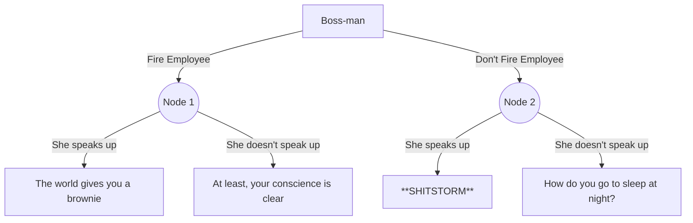
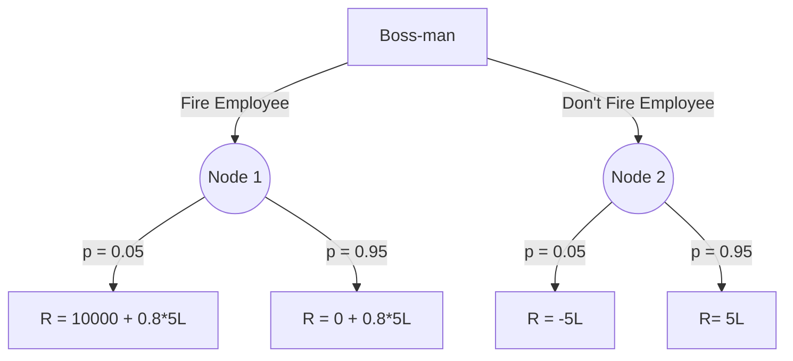

India's having it's own #MeToo movement! A lot of the cases are dealing with sexual harassment at the workplace, and the timing couldn't have been more apt, in a ceremonious sense - this week, we celebrate the 1 year anniversary of the [New York Times](https://www.nytimes.com/2017/10/05/us/harvey-weinstein-harassment-allegations.html) and [New Yorker](https://www.newyorker.com/news/news-desk/from-aggressive-overtures-to-sexual-assault-harvey-weinsteins-accusers-tell-their-stories) articles on Harvey Weinstein that shook the world, and started the #MeToo movement.

A striking similarity one may notice across several of these cases, is that a third party,  and in most scenarios, a third party in the position of power to do something about the case, knew about the transgressions, and chose to do nothing about them. Now when the victim speaks up to the world, usually well after the incident has happened, the third person is left scrambling to improve their image, and in a haste sever ties with the accused, issue profuse apologies, etc etc. I was too intrigued by why so many people, despite being in the position of power to do something about incidences of sexual harassment, choose to do nothing about it, and in effect, give such incidences tacit approval. I was wondering if some concepts from decision theory and probability can be used to model such situations, and hopefully, we may gain some insights into why we're witnessing these trends. Here goes an attempt at doing that!

## The Model

Hypothetical situation - Suppose you're Mr. Yamnat, the boss-man of a comedy company. A female employee comes and tells you in detail about an incident where she was sexually assaulted by a fellow employee a while back. This employee is indeed important for your company, and indeed brings in a good amount of revenue. Now the ball's in your court - you have a decision to make. Suppose the world is really simplistic, with few decision making options - you can either fire him, or choose to continue working with him as your employee (no tertiary arrangements such as freelancing can be worked out in this world!). However, certain things are not under your control - your female employee may choose to speak up to world about this incident, and that will end up having significant consequences on the functioning of your company, depending upon what action you choose to take with the perpetrator. You choose to make the decision matrix, the rewards of whose entries you are totally unclear about, yet. 

|                |Fire Employee		|Don't Fire Employee	|
|----------------|-------------------------------|
|She speaks up to the world| `Unknown`|`Unknown`|
|She doesn't speak up      |`Unknown`|`Unknown`|

Now that this fancy matrix is made, you partake on creating an even fancier representation of the situation, a decision graph, that clearly encapsulates what would happen when you, the agent, takes an action, and when the environment is in a particular configuration (ie, your female employee speaks up, or not). Based on your intuition on how things would pan out, you make the following graph - 

If you fire the employee, and she does speak up, the world gives you a pat on the back. They laud you for doing the right thing, and people trust your company more. If you do fire the employee, and your female employee does not speak up, you may not be in the best situation monetarily, but hey, your care about the culture of your company too, and your conscience is clear that you took a step forward in creating a safe environment for women at your company. If you don't fire the employee, and she does speak up, that's a PR shitstorm, the absolute worst position for you to be in. If you don't fire the employee, and she does not speak up, monetarily things are the status quo, but if you a man conscious about the social implications of your actions, would you be able to sleep soundly at night?

You decide to assign numerical "rewards" to each state. On what basis would you assign these rewards? Well obviously monetarily, because you're a _dhandha_ (business), - it's ruthless, dog-eat-dog world, and at the end of the day, the only question that matters is _deti kitna hai?_ (how much does it give/earn)?

Suppose you don't fire the employee, and she doesn't speak up, and things remain the status quo - your employee is as valuable to you as the revenue he generates for you; for the sake of this discussion, assume that that is 5L per month. Say you don't fire him, and then she does speak up - that is a shitstorm. You have to fire the guy immediately, so the revenue he could have generated for you is gone. Plus people start this entire #BoycottMaytan campaign and stop watching your videos, your collaborators stop working with you (you may even up losing your job), you have to hire this law firm specialising in crisis PR and they charge an exorbitant bill and all. In short, you end up losing roughly 5L, making it's reward equal to -5L.

Say you fire him, and she doesn't speak up. Well, you're without a key employee now, and you go out into the world trying to find a replacement, and that takes time, effort, and money. The replacement would also happen sufficiently into the future, and you care much more about immediate returns as compared to the future ones, so you award a 0.8 decay factor to the revenue the replacement would bring. If you fire the employee, and she does speak up, you get good PR, but that does not make you gain much monetarily. It's a free brownie courtesy the world, and that's it. It gets a token reward of 10000 INR (Those who disagree and think this reward is too low, please hang on). You still have to go out and try to find a new replacement like in the previous case, so the revenue brought in by the new guy is also added with the decay factor.

Now you think, what is the chance that your female employee would speak up? You are being very conservative here, because you are suddenly a very cautious man. You assume on an average, 5% of all women would speak up about sexual harassment at the workplace, even though you know that the figure is waaay higher than what is the reality. ([Read this](https://www.livemint.com/Politics/AV3sIKoEBAGZozALMX8THK/99-cases-of-sexual-assaults-go-unreported-govt-data-shows.html)). You then get this decision tree.

# Inference

Now let's back up the probabilities, and calculate the expected reward of taking each action. Time to bring in the math!

Let the following denote - 

$s$ :  The event that the female employee speaks up
$\overline{s}$ :  The event that she doesn't
$f$ : Employee (the perp) is fired
$\overline{f}$ : Employee (the perp) is not fired
$P(e)$ :  Probability of event $e$ happening
$R(e, a)$ :  The Reward, if action $a$ was taken, and event $e$ happened
$E(a)$ :  The Expected reward, of taking action $a$

The expected reward of firing the employee would be
$$
E(f) = P(s)*R(s,f) + P(\overline{s})*R(\overline{s},f)
$$
and the expected reward of not firing would be 
$$
E(\overline{f}) = P(s)*R(s,\overline{f}) + P(\overline{s})*R(\overline{s},\overline{f})
$$

Now, plugging in our values of reward and probability, we get - 

$$
E(f) = 0.05*(10000+0.8*5L) + 0.95*(0.8*5L ) = 4.005L
$$
and
$$
E(\overline{f}) = 0.05*(-5L) + 0.95*(5L ) = 4.5L
$$

The expected reward of not firing is **higher by a considerable amount, ~50K**. Which action would Mr. Maynat take? The one that **maximizes his expected reward**! And that would definitely be, **not firing** the employee. 

## Further Inference

The values I assumed were fairly conservative, and yet not firing the employee made more monetary sense by a fair margin. [This](https://www.livemint.com/Politics/AV3sIKoEBAGZozALMX8THK/99-cases-of-sexual-assaults-go-unreported-govt-data-shows.html) article says that less than 1% of the cases of sexual assault in India go under-reported. Taking that to be the probability of speaking up instead of 5%, we get $E(f, p(s) = 0.01) = 4.001$, and $E(\overline{f},  p(s) = 0.01) = 4.9$, which makes the decision making process all the more clear. Even if we assume that the PR shitstorm the company has to face if it chooses to not fire their employee, and the female employee does speak up, something like 20L, $E(\overline{f})$ is still $4.75$. Even if we assume the reward the company gets for firing the perp before the female employee speaks up is really high due to the good PR, say 5L, even in that case, The difference between the expected rewards of not firing and firing is more than **80,000**. From the standpoint of a business, which solely cares about maximising profits, and nothing else, it does not make sense to fire the perpetrator employee.

# What does this all mean?